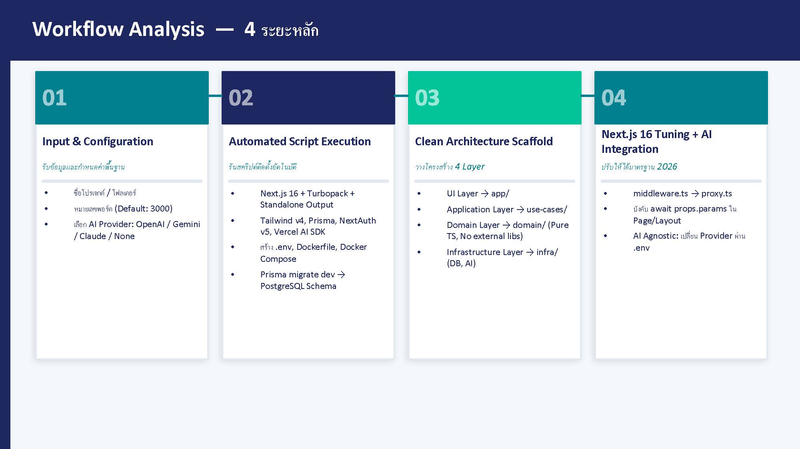
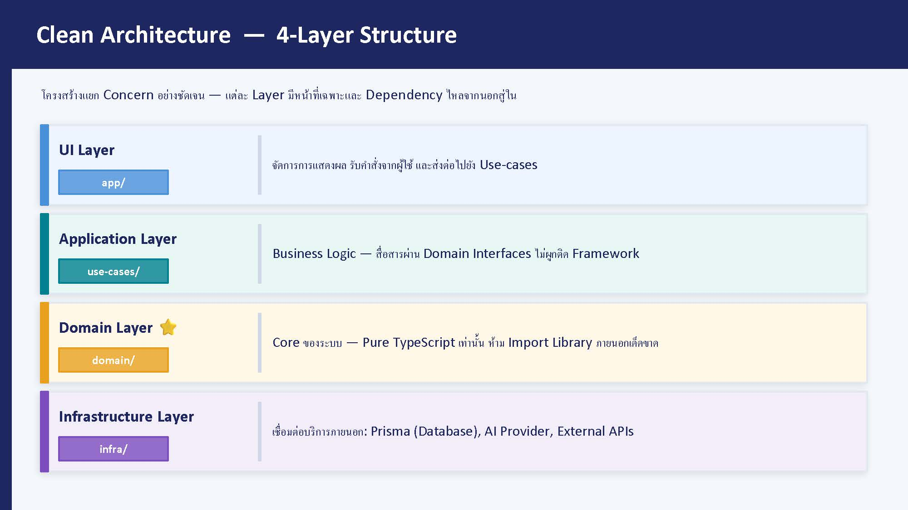

# 🚀 Fullstack Next.js 16 + Tailwind CSS v4 Starter Template
### The Ultimate Clean Architecture Boilerplate for Modern Web Apps

[](https://nextjs.org/)
[](https://tailwindcss.com/)
[](https://www.typescriptlang.org/)
[](https://blog.cleancoder.com/uncle-bob/2012/08/13/the-clean-architecture.html)

---

## 🌐 Overview / ภาพรวมโปรเจกต์

**[EN]** This is a high-performance, enterprise-grade starter template built with the latest **Next.js 16** and **Tailwind CSS v4**. Designed with **Clean Architecture** principles to ensure framework independence, high maintainability, and AI-ready capabilities.

**[TH]** เทมเพลตเริ่มต้นระดับ Enterprise พัฒนาด้วย **Next.js 16** และ **Tailwind CSS v4** ออกแบบตามหลักการ **Clean Architecture** เพื่อให้ระบบรองรับการขยายตัว แยกส่วน Logic ออกจาก Framework อย่างชัดเจน และพร้อมสำหรับการเชื่อมต่อ AI ในระดับโครงสร้าง

---

## ⚙️ Automated Setup Pipeline / กระบวนการติดตั้งอัตโนมัติ

**[TH]** ระบบถูกออกแบบมาให้ติดตั้งสภาพแวดล้อมทั้งหมดพร้อมใช้งานได้ทันทีผ่าน Single Command เพื่อลดเวลาการ Setup และคุมมาตรฐานของ Codebase



* **Stage 1:** Input & Configuration (Project name, Ports, AI Providers).
* **Stage 2:** Automated Script Execution (Turbopack, Prisma, Docker).
* **Stage 3:** Clean Architecture Scaffold (4-Layer creation).
* **Stage 4:** Next.js Tuning & AI Integration.

---

## 🏗️ Clean Architecture (4-Layer Structure)

**[TH]** โครงสร้างที่แยกความรับผิดชอบออกเป็น 4 ชั้น เพื่อความยืดหยุ่นในการเปลี่ยน Technology Stack ในอนาคต



* **UI Layer (`src/app`):** การแสดงผลและรับ Interaction (Next.js App Router).
* **Application Layer (`src/use-cases`):** ส่วนเก็บ Business Logic และ Workflows ของระบบ.
* **Domain Layer (`src/domain`):** หัวใจของระบบ (Pure TypeScript) เก็บ Entities และ Interfaces.
* **Infrastructure Layer (`src/infra`):** ส่วนเชื่อมต่อภายนอก (Database, AI Providers, APIs).

---

## ✨ Key Features / คุณสมบัติเด่น

* 🚀 **Next.js 16 (App Router)** - Fast rendering with Turbopack.
* 🎨 **Tailwind CSS v4** - Zero-config, CSS-first engine.
* 🤖 **AI Agnostic** - สลับ AI Provider (OpenAI, Gemini, Claude) ได้ง่ายผ่าน `.env`.
* 🐳 **Docker Ready** - พร้อมใช้งานบน Container ทันที.
* 🏗️ **Scalable Design** - รองรับระบบงานขนาดใหญ่และการจัดการความเสี่ยง (BCMS Ready).

---

## 🛠️ Getting Started / เริ่มต้นใช้งาน

### 1. Setup Environment
```bash
cp .env.example .env.local
```

### 2. Spin up Database (Docker)
```bash
docker-compose up -d
```

### 3. Install & Run
```bash
npm install
npm run dev
```

---

## 👤 Author

**Bodin Sudwad (YaiBrodin)**
* Computer Technical Officer at the Excise Department, Thailand.
* GitHub: [@reaperinvest](https://github.com/reaperinvest)

---

*Built with ❤️ and AI collaboration (Airin & Airada).*